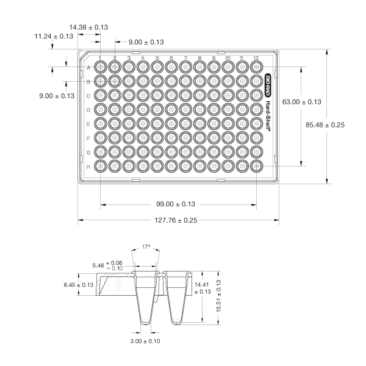
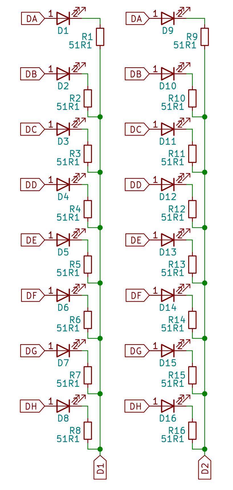

# Open-Plate-Spectrophotometer

An open-source project to build a 96-well spectrophotometer operating at 620nm. Designed from the ground-up focusing on robust electronic design. Funded by the [think[box] Student Project Fund](https://case.edu/thinkbox/funding/student-project-fund) for the 2022-2023 academic year.

## Test Prototype (v0.0.2)

This project was born out of an appreciation for [Cerillo's portable microplate reader](https://cerillo.bio/stratus-2/) and the arrogant desire to open-source it by recreating what they made on my own. I designed a limited test prototype during the summer (I think sometime in July?) before the school year restarted to see what is required to realise the idea of a small form-factor, portable plate reader.

### Concept and Schematic

#### Functional block diagram

The idea is simple: control 96-element grids of LEDs and light sensors to address individual wells in a plate, convert the signal from the light sensor into something machine-parseable, then finally do some ✨math✨ to get an optical density value for each well.

#### LED and photodiode grids

I decided to *not* build a full 96-capable prototype. Instead I opted to test all the relevant units I needed on a smaller scale. The result was a prototype with all 8 rows (A-H) but only two columns.

Independent control of each element is easily achieved by connecting the grid high and low sides to control MOSFETs:

Each row was connected to +5V via p-ch FETs (yes i know, they're wired incorrectly) and each column was connected to GND via n-ch FETs. Each FET gate is assigned its own pin on the MCU to independently control individual elements.
