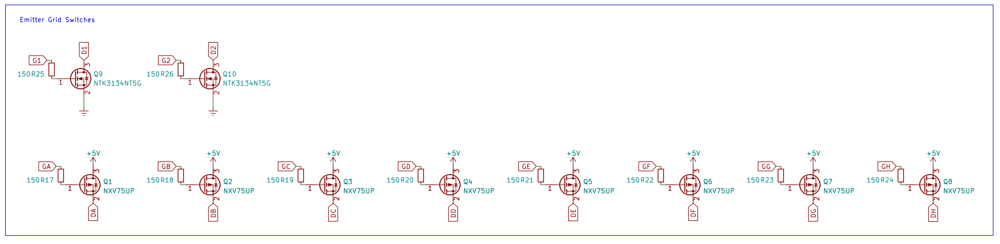
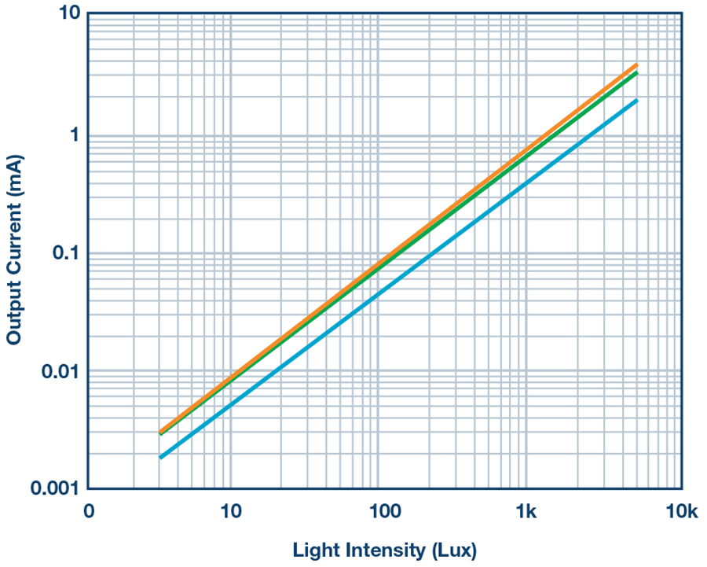

# Open-Plate-Spectrophotometer

An open-source project to build a 96-well spectrophotometer operating at 620nm. Designed from the ground-up focusing on robust electronic design. Funded by the [think[box] Student Project Fund](https://case.edu/thinkbox/funding/student-project-fund) for the 2022-2023 academic year.

## Test Prototype (v0.0.2)

This project was born out of an appreciation for [Cerillo's portable microplate reader](https://cerillo.bio/stratus-2/) and the arrogant desire to open-source it by recreating what they made on my own. I designed a limited test prototype during the summer (I think sometime in July?) before the school year restarted to see what is required to realise the idea of a small form-factor, portable plate reader.

### Concept and Schematic

#### Functional block diagram

The idea is simple: control 96-element grids of LEDs and light sensors to address individual wells in a plate, convert the signal from the light sensor into something machine parsable, then finally do some ✨math✨ to get an optical density value for each well.

#### LED and detector grids

I decided to _not_ build a full 96-capable prototype. Instead, I opted to test all the relevant units I needed on a smaller scale. The result was a prototype with all 8 rows (A-H) but only two columns.

Independent control of each element is easily achieved by connecting the grid high and low sides to control MOSFETs:

Each row was connected to +5V via p-ch FETs (yes i know, they're wired incorrectly) and each column was connected to GND via n-ch FETs. Each FET gate is assigned its own pin on the MCU to independently control individual elements.

A similar idea is used for switching inputs from specific photodiode elements.

#### Detectors: photodiodes vs phototransistors

The hard bit for a device like this taking light that passes through the sample wells and converting that into a digital signal. Initially, I planned on using [phototransistors](https://www.digikey.com/en/articles/the-basics-of-photodiodes-and-phototransistors-and-how-to-apply-them) to transform a change in incident light intensity into a change in current. But these devices are pretty imprecise and do not have the best linearity. To make phototransistors work, I would have needed to do some really careful biasing -- something I did not think I needed.

The alternative was to use photodiodes. These are a bit better in the sense that they would have required a lot fewer supporting components. They also have pretty nice characteristics:

<fig>

<figcaption>Plot from Analog ADI</figcaption>
</fig>

These devices are pretty much linear in their response to incident light intensity: A 10x increase in incident intensity results in a 10x increase in reverse current.

#### Transimpedance amplifiers and ADCs

Converting current going through a photodiode into digital information is a two-step process. This is nothing new; the typical strategy is to use a transimpedance amplifier to convert transform a current signal into a voltage signal followed by an ADC that can convert the voltage signal into a digital value:

<fig>

<figcaption>TIA diagram from wikimedia commons.</figcaption>
</fig>

The transfer function is also pretty simple for a TIA:
$$ V*{out} = -I*{in}R_f $$

This is implemented as:

<fig>

</fig>

The principle is the same, just compressed a little. The current source is replaced by the photodiode, mulit-channel opamps are used to save space, and $V_{out}$ passes through a standard Schottky diode before being connected to the ADC inputs.

I used an 8ch ADC to independently connect each row for pseudo-switching of the detector outputs. High-side p-ch FET switches control V~cc~ for the TIAs.

<fig>

</fig>

The 12-bit ADC converts output voltage into a digital signal referenced to a stable 5V signal generated by a voltage reference amplified by a low-noise voltage follower:

<fig>

</fig>

The MCU, an arduino nano, communicates with the ADC over I^2^C.
